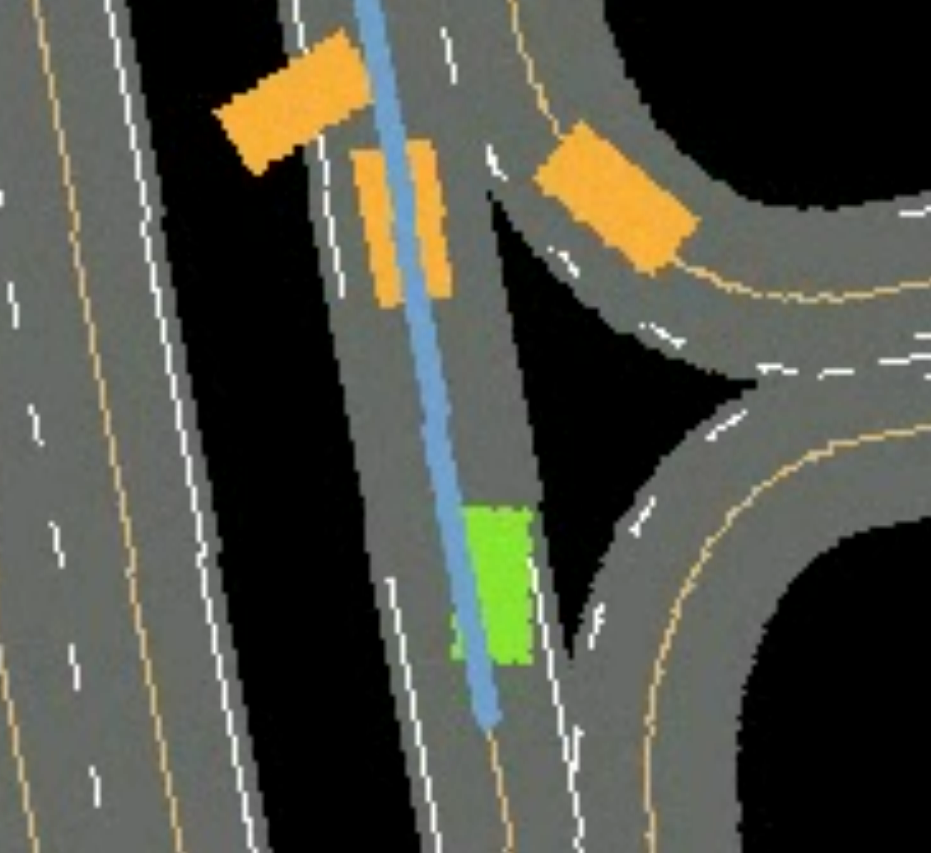

# Resets for RL Expert Robustness
A fork of gym-carla: an [OpenAI gym third party environment](https://github.com/openai/gym/blob/master/docs/environments.md) for the [CARLA simulator](http://carla.org/).

## Recommended system
- Ubuntu 20.04
- +32 GB RAM memory
- NVIDIA RTX 3070 / NVIDIA RTX 3080 / NVIDIA RTX 4090


## Installation

### Install CARLA
1. Install [CARLA 0.9.15 release](https://github.com/carla-simulator/carla/releases/tag/0.9.15). 
```
mkdir -p /opt/carla-simulator
cd /opt/carla-simulator
wget https://tiny.carla.org/carla-0-9-15-linux
tar -xvzf carla-0-9-15-linux
rm carla-0-9-15-linux
```
2. Install client library
```
export PYTHONPATH=$PYTHONPATH:/opt/carla-simulator/PythonAPI/carla/dist/carla-0.9.15-py3.7-linux-x86_64.egg
```
If you have previously installed the client library with pip, this will take precedence over the .egg file. You will need to uninstall the previous library first.

### Setup our package
1. Setup conda environment
```
conda create -n env_name python=3.7
conda activate env_name
```

2. Clone this git repo in an appropriate folder
```
git clone https://github.com/montrealrobotics/gym-carla.git
```

3. Enter the repo root folder and install the packages:
```
cd gym-carla
pip install -r requirements.txt
pip install -e .
```

## Usage

### Training
1. Launch CARLA:
```
bash /opt/carla-simulator/CarlaUE4.sh -fps=10 -quality-level=Epic -carla-rpc-port=4000 -RenderOffScreen
```
2. Modify the config file:
The file `gym-carla/src/gym_carla/conf/config.yaml` contains parameters used for defining the training characteristics. The main parameters you should pay attention to are:
- `num_steps`: size of batch of environment steps that will be collected before training
- `total_timesteps`: total steps that you want to train for
- `num_vehicles`: number of external vehicles to spawn for every episode
- `headless`: set to false if you want to render the BEV of the agent
- `p`: probability with which to sample from the collision scenario distribution for resets
- `min_collision_scenes`: number of collision scenarios to collect before we consider sampling
- `delta_past_step`: at what time intervals to save scene information (1 step is 0.1s)
- `max_past_step`: size of scene history buffer

3. Start the training:
```
python gym-carla/src/gym_carla/agents/ppo/ppo.py
```

4. Troubleshooting:

- If you see an error along the lines of:
  ```
  FileNotFoundError: [Errno 2] No such file or directory: 'birdview_v3_cache/Carla/Maps/Town03__px_per_meter=16.0__opendrive_hash=ec2989811f7481fc0c59c5132ffadaa8ba04102c__margin=300.npy.lock
  ```
  Create the directory by running `mkdir -p birdview_v3_cache/Carla/Maps`

- If the client exits with a segmentation fault on the first try, simply rerun the script.

### Evaluation
1. Launch CARLA:
```
bash /opt/carla-simulator/CarlaUE4.sh -fps=10 -quality-level=Epic -carla-rpc-port=4000 -RenderOffScreen
```

2. Modify the config file:
The file `gym-carla/src/gym_carla/conf/config.yaml` contains parameters used for defining the evaluation characteristics. Modify the parameter accordig to the evaluation mode you want to use. The evaluation script allows for three distinct modes:
    1. Evaluate on `num_test_episodes` episodes
    2. Evaluate until you reach `num_test_scenarios` crashes
    3. Evaluate on a given file of crash scenarios: `test_on_collisions`

## Description
1.  We provide a dictionary observation including birdeye view semantic representation (obs['birdeye']) using a customized fork of the repository [carla-birdeye-view](https://github.com/akuramshin/carla-birdeye-view):
<div align="center">
  
</div>
We also provide a state vector observation (obs['state']) which is composed of lateral distance and heading error between the ego vehicle to the target lane center line (in meter and rad), ego vehicle's speed (in meters per second), and and indicator of whether there is a front vehicle within a safety margin.

2. The termination condition is either the ego vehicle collides, runs out of lane, reaches a destination, or reaches the maximum episode timesteps. Users may modify function _terminal in carla_env.py to enable customized termination condition.

3. The reward is a weighted combination of longitudinal speed and penalties for collision, exceeding maximum speed, out of lane, large steering and large lateral accleration. Users may modify function _get_reward in carla_env.py to enable customized reward function.
